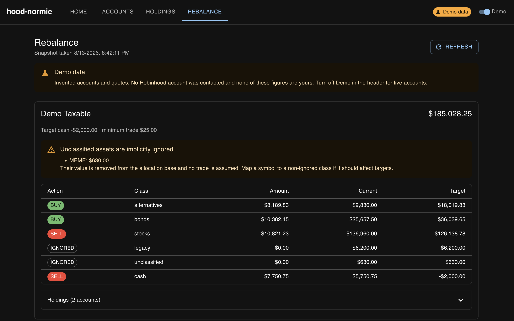

# hood-normie

A Python library that turns Robinhood's official Trading MCP server into an
ordinary API, plus three examples built on it: an asset-allocation rebalancer, a
local web app, and a handful of command-line tools.

The library speaks MCP at the transport layer, but `RobinhoodClient` exposes
read-only portfolio methods and **nothing here places a trade**.

## Contents

| Path | What it is |
| --- | --- |
| `hood_normie/` | The library: transport, OAuth, and a normalized client |
| `examples/rebalance/` | Asset-allocation rebalancing guidance |
| `webapp/` | A local browser view over accounts, holdings, and the plan |
| `examples/` | Command-line tools for authenticating and listing |
| `hooks/` | Pre-commit hooks that keep secrets out of the repo |

## The library

`hood_normie` handles what sits between an MCP endpoint and usable portfolio
data:

- Streamable HTTP MCP transport and JSON-RPC tool calls.
- OAuth 2.1 discovery, PKCE authentication, token storage, and refresh.
- Account discovery, selection, and labeling.
- Typed access to accounts, portfolios, equity positions, and quotes.
- Normalization of Robinhood's response shapes into stable fields, including
  multi-account snapshots with a shared price map.

Depend on `//hood_normie`, then:

```python
from hood_normie import RobinhoodClient

client = RobinhoodClient.from_token_file(".robinhood-mcp-token.json")

# Every account, with its positions marked at the latest quote.
for account in client.fetch_holdings():
    print(account["label"], account["cash"])

# Or one snapshot across chosen accounts, sharing a single set of quotes.
snapshot = client.fetch_portfolios(account_numbers=["ACCOUNT_ONE"],
                                   quote_symbols=["VTI", "BND"])
```

To call a tool the high-level client does not wrap, drop to
`RobinhoodMcpClient(endpoint, access_token)` and use `call_tool` directly.

## Authenticate first

Every example reads the same token file. Authenticating opens a browser and
stores credentials in a git-ignored `.robinhood-mcp-token.json`:

```sh
bazel run //examples:authenticate
```

## Example: asset-allocation rebalancing

Declare what fraction of the portfolio each asset class should hold, and the
rebalancer reports the dollar adjustment per class needed to get there:

```sh
cp examples/rebalance/config.example.yaml config.yaml
bazel run //examples/rebalance
```

```text
◆ REBALANCE PLAN
ACTION CLASS              AMOUNT      CURRENT       TARGET
BUY    bonds        $   1,800.00 $  18,000.00 $  19,800.00
SELL   stocks       $     800.00 $  80,000.00 $  79,200.00
SELL   cash         $   1,000.00 $  -1,000.00 $  -2,000.00
```

The output is guidance, not orders: it names a class and an amount, never a
security, and it places nothing. The config holds a list of portfolios, each
with its own accounts and targets over one shared symbol classification, and
each is rebalanced independently. Accounts held elsewhere can be tracked by hand
so the allocation covers everything you own, not just what Robinhood sees.

Ignored classes, fixed-dollar targets, margin cash targets, and the rest of the
configuration are documented in
[`examples/rebalance/README.md`](examples/rebalance/README.md).

## Example: local web app

The same data in a browser — one tab each for accounts, holdings, and the
rebalance plan, with sortable and searchable tables and CSV export:

```sh
bazel run //webapp:server
```



Then open <http://127.0.0.1:8765>. A Python server hosts a React + TypeScript +
MUI single-page app and answers a small read-only JSON API. The listener binds
to loopback only, because the report contains account numbers and balances and
nothing authenticates the caller.

A **Demo** chip in the header swaps your accounts for invented ones, so the app
can be browsed and screenshotted without an account or a `config.yaml`. Details
are in [`webapp/README.md`](webapp/README.md).

## Example: command-line tools

List the accounts the authenticated token can read:

```sh
bazel run //examples:list_accounts
```

List equity holdings across every account, or narrow to one:

```sh
bazel run //examples:list_holdings
bazel run //examples:list_holdings -- --account ACCOUNT_NUMBER
```

Both take `--endpoint`, `--token-file`, and `--verbose`, which prints the MCP
JSON-RPC traffic to stderr when a response needs inspecting.

## Development

The build is [Bazelisk](https://github.com/bazelbuild/bazelisk) plus Bazel;
`.bazelversion` pins the version, so a checkout needs no other setup. Python
3.11 and its dependencies come from `rules_python` and `requirements_lock.txt`;
the web app's Node and pnpm come from `aspect_rules_js`, so neither has to be
installed on the host.

```sh
bazel test //...
```

That covers unit tests, the `//:typecheck` mypy target in `--strict` mode,
`tsc --noEmit` for the frontend, and small Node tests for the CSV and sorting
logic. Run the type check alone with `bazel test //:typecheck`.

Two pre-commit hooks guard the repo — `detect-secrets`, and a detector for
Robinhood account numbers, since this project's output is full of them. Install
them, or run them over every tracked file:

```sh
bazel run //hooks:install
bazel run //hooks:all
```
